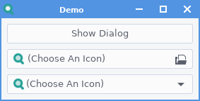
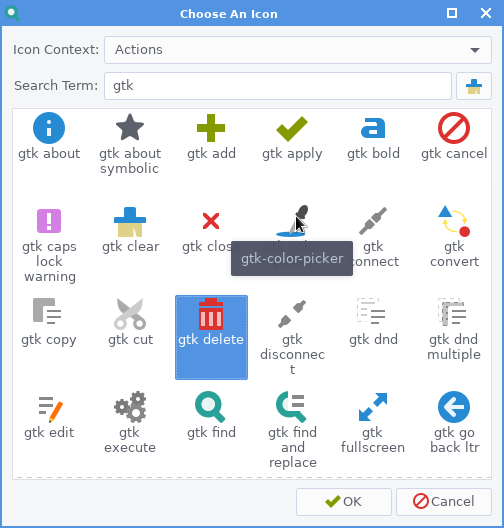
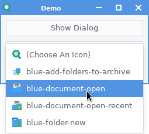
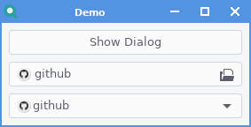

# About
GtkThemedIconChooser is a set of GTK+ 3 objects (2 widgets and 1 dialog) for Python3, allowing selection of themed icons from the current icon theme.



- **IconChooserDialog:** GTK Dialog to display themed icons, grouped by context (Applications, Actions, Emoticions, etc.). Icons can be filtered by context or filter term. The name of the selected icon is returned by the `run` method, or via the `get_selected_icon_name` method.

  

- **IconChooserButton:** GTK Button to open an IconChooserDialog and display the result like a GTK FileChooserButton. The name of the selected icon is returned via a new `icon-selected` signal, or via the `get_selected_icon_name` method.

  

- **IconChooserComboBox:** GTK Combo Box to display icons in a combo box. The name of the selected icon is returned via the `get_selected_icon_name` method. See the warning below on using this for selection from many icons.

  

  

# Demo
A demo, `demo.py` is also provided to demonstrate apperance and behaviour of the widgets.



# Usage
Currently this is just the Python classes without any Gtk Builder support. Use them as you would any other widget.

**IconChooserDialog:**
```
my_dialog = IconChooserDialog()
icon_name = my_dialog.run()
```
**IconChooserButton:**
```
my_button = IconChooserButton()
my_button.connect('icon-selected', on_icon_selected)

def on_icon_selected(name):
    my_icon_name = name
```
**IconChooserComboBox:**
```
my_combo = IconChooserComboBox()
my_button.connect('changed', on_icon_selected)

def on_icon_selected(combo):
    my_icon_name = my_combo.get_selected_icon_name()

```
**Common Methods:**
- `get/set_context_filter()`: Gets/sets a list of icon contexts for which icons
should be shown. An empty list means all contexts are used - This is the default.
- `get/set_search_term()`: Gets/sets a string to use to search for items. If no term is set, no filtering is done - This is the default.
- `get/set_use_regex()`: Gets/sets whether to use regex for icon name searching. If `True`, the filter term is used as a regex pattern for matching applications by their display name. If it is set to `False` then basic, case-insensitive, substring matching of the display name is used - This is the default.
- `get_selected_icon_name()`: Gets the name of the selected icon.

**IconChooserDialog/Button Methods:**

- `get/set_icon_size()`: Gets/sets the pixel size to display icons in the dialog, default is 32 px.

**IconChooserComboBox Methods:**

- `populate()`: Used to populate the combo box. This is a costly operation which must be done on the main thread, and will freeze your UI if 100s of icons are being displayed. This should be called prior to showing the widget, although this is not done automatically so that you may first set a filter term or desired icon contexts.

**Icon Searching:**

If `use_regex` is set to `True`, the search term is used as a regex pattern for matching icons. If it is set to `False`, the search term is compared against icon names case-insensitive, with underscores and dashes replaced with spaces.

### Warning on Number of Icons Displayed
An icon theme can have 1000s of icons, each of which is represented with a widget, all of which must all be shown in the main thread. Showing 1000s of icons will likely block your main thread for up to several seconds - a noticeable freeze in the UI.

The **IconChooserDialog** (also used by **IconChooserButton**) manages this fairly well - icon previews are loaded asynchronously and only 1 context at once is shown so that the UI will freeze for less than a second, which is often unnoticeable.

The **IconChooserComboBox** really depends on what you're trying to do with it. Limit it to a couple of contexts and/or a good search term and you won't notice a thing (while also giving your user half a chance of finding their desired icon). If you give no filters and the combobox tries to load 10,000 icons then expect long delays.
